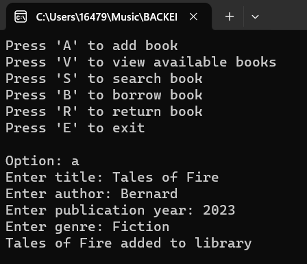

## Library Management System
This is a console based application that allows you interact with a library catalog. You can add, view, search, borrow and return books.

Quickly, you will see how to run the application and a brief overview of features

### Built With


## Demo
A demo is shown below:



## Getting Started
Follow these steps to run the application:

1. In the ```LibraryManagementSystem``` folder, click on the ```bin``` folder. 
2. In the ```bin``` folder, open the ```debug``` folder. 
3. In the ```debug``` folder, click on the ```LibraryManagementSystem``` executable file to run the application

This should prompt your console to open and you will see a list of options as shown in the demo earlier. Choose any of these options and follow the prompts to use the application.

You can add a book by entering the book details such as title, author, publication year and genre.

Also, you can view all available books or available books based on a genre.

Furthermore, you can search for a particular book of choice, borrow and return books.

There is no special instruction as the application is fairly easy to use. Hope you enjoy using this application!